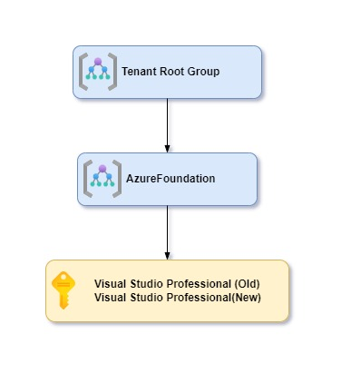
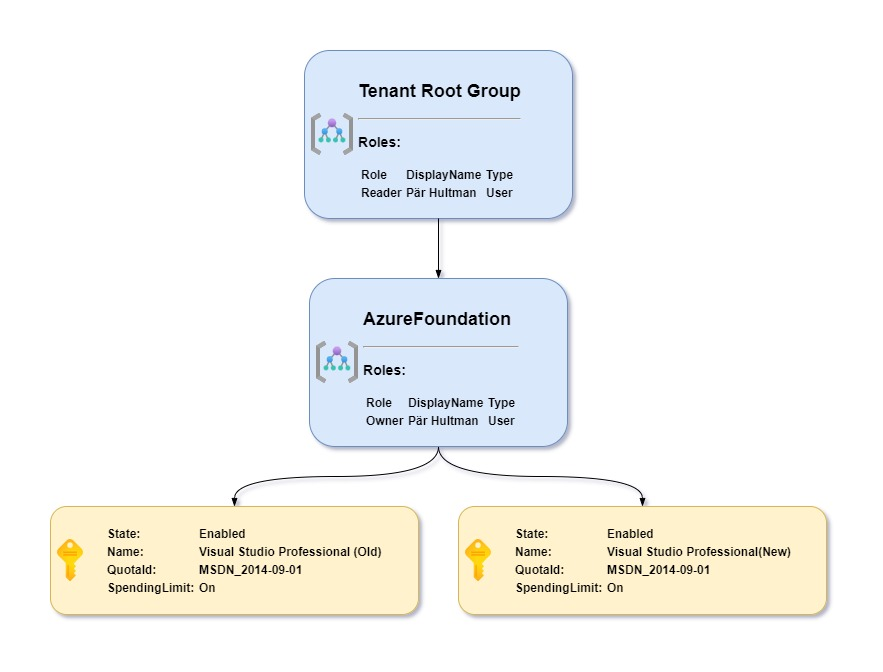

# New-MgmGroupDiagram #

A small Powershell module that only contains one function for creating diagrams from your Azure Managementgroups and Subscriptions hierarchy


## How do I get set up? ##

* Requires at least PowerShell 7 and Azure PS modules Az.Resources and Az.Accounts
* Uses and requires default valid AzContext

## How to use ##
First import the module
```powershell
Import-Module -Name .\MgmGroupDiagram\MgmGroupDiagram.psm1
```
Then the simplest variant is just to run the command
```powershell
New-MgmGroupDiagram  | Set-Clipboard
```
Then open diagrams.net and select Arrange/Insert/Advanced/CSV...

Clear the box with CSV and then paste the result from the command.

In my example this would result in a diagram that looks like this:

[](./doc/simple.jpg)

Let's get some more details in our diagram
```powershell
New-MgmGroupDiagram -IncludeManagementGroupRoles -ExpandSubscriptions -IncludeSubscriptionDetails  | Set-Clipboard
```
Then open diagrams.net and select Arrange/Insert/Advanced/CSV...

Clear the box with CSV and then paste the result from the command.

In my example this would result in a diagram that looks like this:

[](./doc/details.jpg)


get-help New-MgmGroupDiagram -ShowWindow
For full documentation of command run `Get-Help New-MgmGroupDiagram -ShowWindow` or see help [here](./doc/New-MgmGroupDiagram.md)